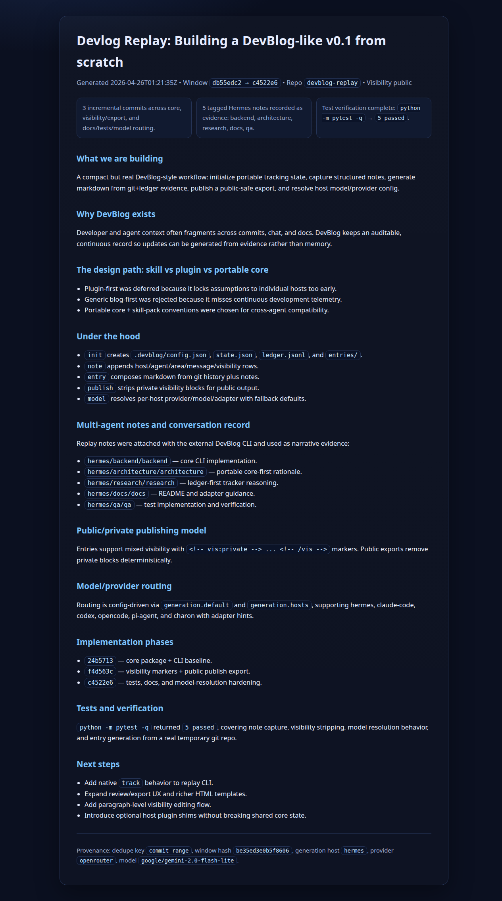

# DevBlog

> A portable, cross-agent development blog for active coding projects.

DevBlog watches what changed in a repository, collects notes from any agent working on it, and periodically turns that evidence into a clear development post. Use it for private project memory, public build-in-public updates, or a polished blog generated every 12 hours from real repo activity.

It is not a generic blog prompt. It is a small file contract plus a CLI that Hermes, Claude Code, Codex, OpenCode, Pi Agent, Charon, and plain shell scripts can all share.

<p align="center">
  <a href="https://github.com/NousResearch/hermes-agent"></a>
  <a href="https://github.com/DanielSuncost/charon"></a>
  <a href="https://github.com/badlogic/pi-mono"></a>
  <a href="https://github.com/anthropics/claude-code"></a>
  <a href="https://github.com/openai/codex"></a>
  <a href="https://github.com/opencode-ai/opencode"></a>
</p>

<p align="center">
  <a href="docs/integrations.md"><strong>Agent integration guide</strong></a>
  ·
  <a href="adapters/hermes/README.md">Hermes</a>
  ·
  <a href="adapters/charon/README.md">Charon</a>
  ·
  <a href="adapters/pi-agent/README.md">Pi Agent</a>
  ·
  <a href="adapters/claude-code/README.md">Claude Code</a>
  ·
  <a href="adapters/codex/README.md">Codex</a>
  ·
  <a href="adapters/opencode/README.md">OpenCode</a>
</p>

## What it gives you

| Feature | What it means |
| --- | --- |
| Scheduled dev posts | Generate entries every 12 hours, daily, or on any cron cadence. |
| Evidence-based writing | Summaries come from git activity, ledger events, tests, and agent notes. |
| Shared `.devblog/` state | All hosts use the same config, cursor state, ledger, and markdown entries. |
| Multi-agent notes | Different agents can add tagged context without owning the workflow. |
| Public/private controls | Mark sensitive blocks private, review them locally, and export public-safe posts. |
| Publishing formats | Export public markdown, HTML, Substack-ready HTML, or clipboard output. |
| Model routing | Keep per-host provider/model choices in one project config. |
| Portable core | Stdlib-first Python CLI; no host-specific lock-in. |

## Screenshot

A generated DevBlog entry from the dogfood replay, exported as screenshot-ready HTML. It shows the full post, including implementation phases, tests, next steps, and provenance metadata.



## The file contract

Every project gets the same portable state directory:

```text
.devblog/config.json        project config and model policy
.devblog/state.json         cursors, window hashes, duplicate prevention
.devblog/ledger.jsonl       evidence events and agent notes
.devblog/entries/*.md       generated development posts
```

Because the state is just files, any agent or cron job can participate.

## Quick start

```bash
git clone git@github.com:DanielSuncost/devblog.git
cd devblog
python -m pip install -e .

devblog init --repo /path/to/project
devblog track --repo /path/to/project --once
devblog note --repo /path/to/project --host hermes --agent core --area backend --message "Finished scheduler integration."
devblog entry --repo /path/to/project --host hermes
devblog publish --repo /path/to/project --format public-md -o /path/to/project/devblog.md
```

## Agent plugins and install guidance

DevBlog ships thin adapter/plugin files for each host. Install them into any project with:

```bash
devblog init --repo /abs/project
devblog install-adapter --repo /abs/project --host all
```

That writes host-specific prompts, task files, and instruction snippets under `.devblog/adapters/<host>/` for Hermes, Charon, Pi Agent, Claude Code, Codex, and OpenCode. See [`docs/integrations.md`](docs/integrations.md) for per-agent setup.

## Cron-style use

A typical scheduled run captures the latest evidence, writes one entry for the current window, and exports a public copy:

```bash
devblog track --repo /path/to/project --once
devblog entry --repo /path/to/project --host hermes
devblog publish --repo /path/to/project --format substack-html -o /path/to/project/out/devblog.html
```

Run that from Hermes cron, system cron, Charon, or any shell-capable agent every 12 hours.

## Core commands

| Command | Purpose |
| --- | --- |
| `init` | Create the `.devblog/` config, state, ledger, and entries directory. |
| `track` | Capture current project/git evidence once or continuously. |
| `note` | Append a tagged host/agent/area note to the shared ledger or latest entry. |
| `entry` | Generate a markdown development post from the current evidence window. |
| `status` | Show DevBlog state and recent activity. |
| `model` | Resolve the provider/model/adapter for a given host. |
| `review` | Open the local review UI for visibility tagging and export. |
| `visibility` | Set entry or paragraph-level public/private/mixed classification. |
| `lint` | Flag risky public wording before publishing. |
| `publish` | Export public-safe markdown, HTML, Substack HTML, or clipboard text. |

## Multi-agent notes

```bash
devblog note --repo . --host opencode --agent frontend --area ui --message "Built dashboard shell."
devblog note --repo . --host codex --agent backend --area api --message "Prepared API contract."
devblog note --repo . --host pi-agent --context-file conversation.txt
devblog note --repo . --host charon --agent research --area research --message "Added paper notes." --entry latest
```

Supported hosts: `hermes`, `claude-code`, `codex`, `opencode`, `pi-agent`, and `charon`.

## Public and private content

Generated entries can mix shareable and sensitive sections. Wrap private blocks directly in markdown:

```markdown
<!-- vis:private -->
Internal strategy, secrets, or non-public context goes here.
<!-- /vis -->
```

`devblog review` provides a local UI to flip visibility, preview the public version, lint risky language, and export publish-ready markdown or HTML.

## Repository layout

```text
src/devblog/        stdlib-only CLI implementation
spec/               schemas, visibility rules, and architecture notes
adapters/           host integration notes for Hermes, Claude Code, Codex, OpenCode, Pi Agent, Charon
registries/         reusable skill registry manifests
examples/           sample configs and usage patterns
templates/          generation prompts and entry templates
tests/              behavior tests for visibility, models, and multi-agent notes
```

## Design principles

- Evidence first: never invent project progress.
- Compact narratives: explain what changed, why it matters, and what is next.
- Public-safe publishing: private details stay marked and removable.
- Cross-agent by default: no host gets special ownership of state.
- Cheap model routing: use smaller models where they are good enough.

## Current status

Alpha/MVP. The core CLI, shared state format, model routing, multi-agent notes, visibility tags, review/publish flow, and tests are in place. The next layer is deeper host automation and richer scheduled publishing defaults.
